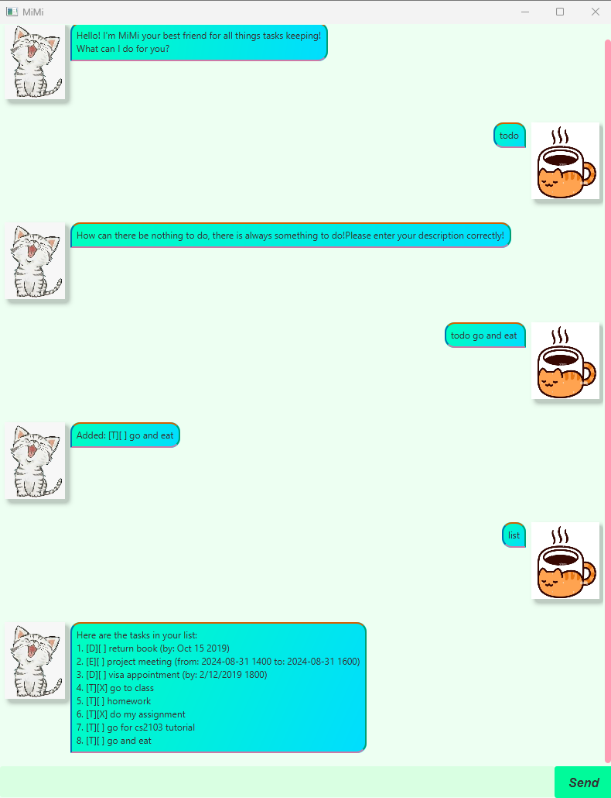

# MiMi User Guide
## Introduction
MiMi is a simple task manager chatbot that helps you keep track of your todos, deadlines and events via a friendly chat-based GUI.
It stores your tasks on your computer in a txt file so they are saved between sessions.
Not only that MiMi allows you to mark, unmark and find all aspects of your busy life!

## Installation
1. Ensure you have **Java 17 or above** installed on your computer.
2. Download the latest `MiMi.jar` file from the **Releases** page.
3. Place the file in your desired folder.
4. Double-click the `MiMi.jar` file **or** run the following command:
5. The MiMi GUI will launch. Type commands into the input box and press Enter/Send to interact.

   ```bash
   java -jar MiMi.jar
   ```

# Features
## 1. Adding To-Dos
Add a simple to do task to your list.
- **Format**
 ```bash
   todo TASK_NAME
 ```
- **Example:**
 ```bash
   todo TASK_NAME
```

## 2. Adding Deadlines
Add a task with a deadline.
- **Format**
 ```bash
   deadline TASK_NAME /by DATE
 ```
- **Example:**
 ```bash
   deadline submit report /by 2025-09-10
```

## 3. Adding Events
Add an event with start and end times.
- **Format**
 ```bash
   event EVENT_NAME /from START /to END
 ```
- **Example:**
 ```bash
   event project meeting /from 2025-09-07 14:00 /to 2025-09-07 16:00
```

## 4. Adding Tasks Within a Period
Add a task that must be done within a specific period.
- **Format**
 ```bash
   within TASK_NAME /from START_DATE /to END_DATE
 ```
- **Example:**
 ```bash
   within collect cert /from 2025-01-15 /to 2025-01-25
```

## 5. Listing All Tasks
Show all tasks currently stored.
- **Format**
 ```bash
   list
 ```
- **Example Output:**
 ```bash
   Here are the tasks in your list:
1. [T][ ] buy groceries
2. [D][ ] submit report (by: 2025-09-10)
3. [E][ ] project meeting (from: 2025-09-07 14:00 to: 2025-09-07 16:00)
4, [W][ ] collect cert (from: 2025-09-01 14:00 to: 2025-09-07 16:00)
```
**Explanation of what each symbol stands for**
- `[T]` = To do
- `[D]` = Deadline
- `[E]` = Event
- `[W]` = Within
- `[ ]` = Not done
- `[X]` = Done

## 6. Marking/Unmarking Tasks as Done/Not Done
Mark a task as completed.
- **Format**
 ```bash
   mark INDEX || unmark INDEX
 ```
- **Example:**
 ```bash
   mark 1 || unmark 1
```

## 7. Deleting Tasks
Remove a task from your list.
- **Format**
 ```bash
   delete INDEX
 ```
- **Example:**
 ```bash
   delete 1
```

## 8. Finding Tasks
Find tasks that contain a keyword.
- **Format**
 ```bash
   find KEYWORD
 ```
- **Example:**
 ```bash
   find go to class
```
- **Example Output:**
 ```bash
Here are the matching tasks in your list:
1. [T][ ] read book
2. [D][ ] return book (by: 2025-10-15)
```

## 8. Exiting the Program
Exiting MiMi.
- **Format**
 ```bash
   bye
 ```
# Data Saving
- Your tasks are automatically saved to `data/MiMi.txt`
- They are reloaded every time you start MiMi